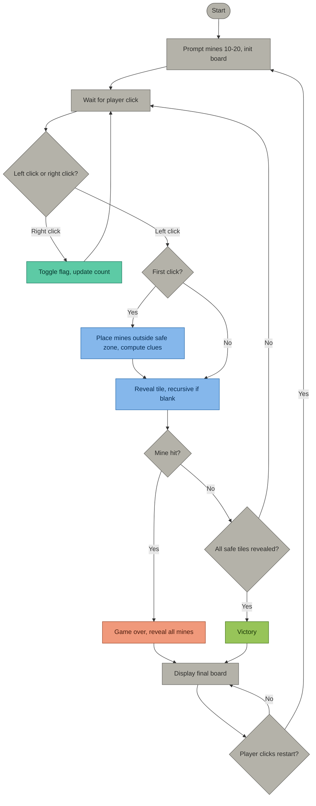

```mermaid
flowchart TD
    Start([Start]) --> Setup[Prompt mines 10-20, init board]
    Setup --> WaitInput[Wait for player click]
    WaitInput --> ClickType{Left click or right click?}
    ClickType -- Right click --> ToggleFlag[Toggle flag, update count]
    ToggleFlag --> WaitInput
    ClickType -- Left click --> FirstClick{First click?}
    FirstClick -- Yes --> PlaceMines[Place mines outside safe zone, compute clues]
    PlaceMines --> RevealTile[Reveal tile, recursive if blank]
    FirstClick -- No --> RevealTile
    RevealTile --> MineHit{Mine hit?}
    MineHit -- Yes --> GameOver[Game over, reveal all mines]
    MineHit -- No --> AllRevealed{All safe tiles revealed?}
    AllRevealed -- Yes --> Victory[Victory]
    AllRevealed -- No --> WaitInput
    GameOver --> DisplayFinal[Display final board]
    Victory --> DisplayFinal
    DisplayFinal --> Restart{Player clicks restart?}
    Restart -- No --> DisplayFinal
    Restart -- Yes --> Setup

    classDef gray fill:#B4B2A9,stroke:#5F5E5A,color:#2C2C2A
    classDef blue fill:#85B7EB,stroke:#185FA5,color:#042C53
    classDef teal fill:#5DCAA5,stroke:#0F6E56,color:#04342C
    classDef coral fill:#F0997B,stroke:#993C1D,color:#4A1B0C
    classDef green fill:#97C459,stroke:#3B6D11,color:#173404

    class Start,Setup,WaitInput,ClickType,FirstClick,MineHit,AllRevealed,DisplayFinal,Restart gray
    class PlaceMines,RevealTile blue
    class ToggleFlag teal
    class GameOver coral
    class Victory green
```
